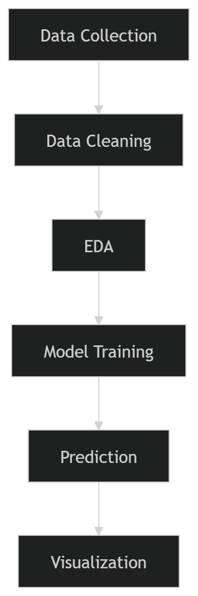
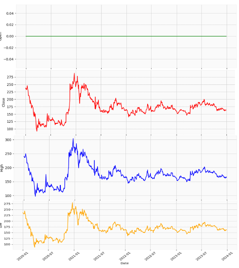
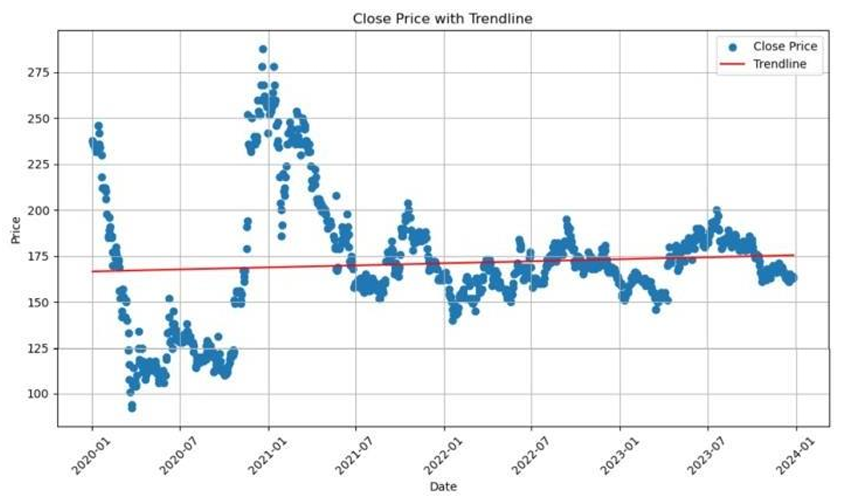
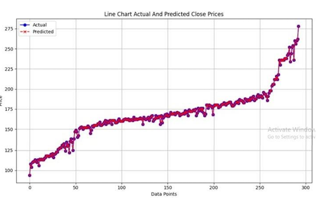

# Studi Prediksi Pasar Saham ASRI Menggunakan Metode Linear Regresi

Linear Regression Based Analysis

        

-Overview

This project focuses on analyzing and predicting the stock price movement of PT ASRI using the Linear Regression algorithm.
The research utilizes historical stock market data from 2020–2023 to identify patterns, analyze trends, and generate future stock price predictions.

Research Objectives

1. Analyze stock market trends of PT ASRI
2. Predict future stock prices using Linear Regression
3. Compare actual and predicted stock values
4. Apply PySpark for big data analysis
5. Visualize stock movement patterns effectively

-Tools & Technologies
Python, Pandas, NumPy, Matplotlib, Scikit-learn, PySpark

-How It Works

-Dataset

- **Date**
- **Open Price**
- **High Price**
- **Low Price**
- **Close Price**
- **Volume**

Source: Kaggle

The dataset used in this project contains historical stock data of PT ASRI from 2020 to 2023.

-Methodology

Linear Regression Model

This project uses Linear Regression to model relationships between:

Independent variables → historical stock data

Dependent variable → stock price

The model learns patterns from historical trends to predict future values.

Visualization Results
- **Candlestick Chart**

Displays stock price fluctuations over time.

- **Trendline Chart**

Shows stock market trend movement year by year.

- **Actual vs Predicted Chart**

Compares actual stock prices with predicted prices generated by the Linear Regression model.

-Results & Findings

The Linear Regression model successfully identified stock movement patterns from historical data and generated stock trend predictions.

Key Findings:
- *Historical stock prices influence future predictions*
- *Trend visualization helps understand market movement*
- *Linear Regression provides simple yet effective forecasting*

Although the prediction model still has limitations, the research provides useful insights for:

- *Investors*
- *Financial analysis*
- *Stock market studies*

-Conclusion

This research demonstrates that the Linear Regression method can be effectively used for stock trend analysis and prediction. The project also highlights the importance of data visualization and historical trend analysis in financial forecasting.
